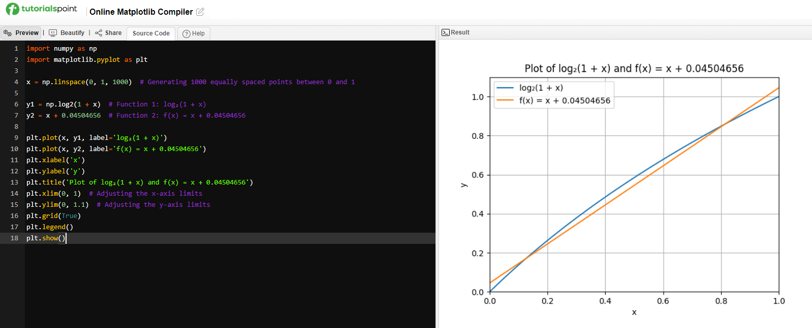

# q3inversesqrtnumpy
All credits to GPT3 for writing this code, I'm just the prompt guy

Use something like https://www.tutorialspoint.com/execute_matplotlib_online.php to run online

For more context goto https://attackofthefanboy.com/articles/the-quake-iii-algorithm-that-defies-math-explained/
Or google "Q3 Arena inverse square root estimation hack" 

The goal of this is to illustrate how easy it is to use GPT3 and python to plot a funcition and log() chart which illustrates the deviation of the fast inverse square root calculation hack versus the "correct" calculation.

BUT THAT'S NOT THE POINT!!! The POINT is that a vector estimation hack with 0.1% effect increases the skill ceiling of the game by more than 10% of overall run speed time, as fps is fixed at 125 and every single frame allows for a fininte and calculatable amount of speed units more gained! That's why Q3 is the greatest of all speedrunning games!!! 

How cool is that?! The limitations of not having hardware inverse square root and Terje Mathisen and John Carmack genious gave us the game with the highest speedrunning skill ceiling ever. The estimation function measuring air acelleration vector has a 0.1% deviation, which players can manupulate 125 times per second by mouse orientation synced with strafe keyboard presses to achieve ~10% better overal run speeds.
########

GPT3 prompt and response below:

#####

We need to plot the following:

1. log2(1 + x) 
2. f(x)=x +  0.04504656 

The range of the chart is 0 to 1

ChatGPT
Certainly! Here's the code to plot the functions "log₂(1 + x)" and "f(x) = x + 0.04504656" within the range 0 to 1:

python
Copy code
import numpy as np
import matplotlib.pyplot as plt

x = np.linspace(0, 1, 1000)  # Generating 1000 equally spaced points between 0 and 1

y1 = np.log2(1 + x)  # Function 1: log₂(1 + x)
y2 = x + 0.04504656  # Function 2: f(x) = x + 0.04504656

plt.plot(x, y1, label='log₂(1 + x)')
plt.plot(x, y2, label='f(x) = x + 0.04504656')
plt.xlabel('x')
plt.ylabel('y')
plt.title('Plot of log₂(1 + x) and f(x) = x + 0.04504656')
plt.xlim(0, 1)  # Adjusting the x-axis limits
plt.ylim(0, 1.1)  # Adjusting the y-axis limits
plt.grid(True)
plt.legend()
plt.show()
In this code, we generate 1000 equally spaced points between 0 and 1 using np.linspace(). Then, we compute the y-values for Function 1, which is "log₂(1 + x)", and Function 2, which is "f(x) = x + 0.04504656". Finally, we plot both functions on the same chart using plt.plot().

The resulting plot will display the curves for both functions within the specified range of 0 to 1. The x-axis represents the values of x, and the y-axis represents the corresponding values of each function.
